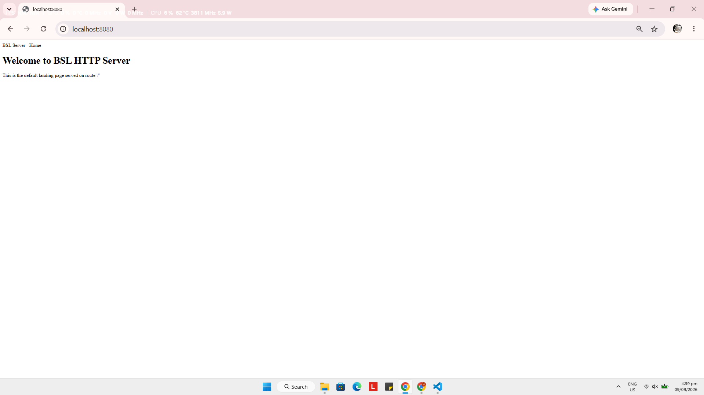
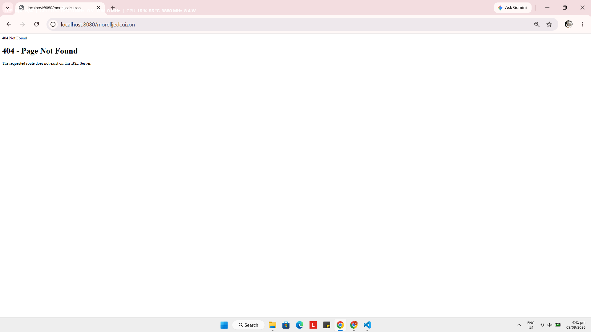
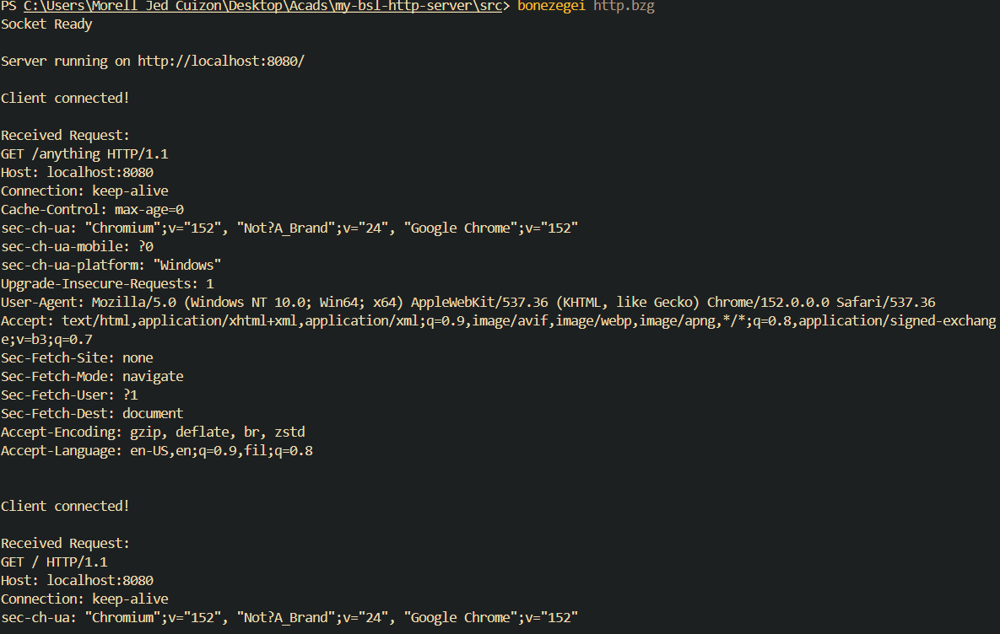

# BSL HTTP Server

A low-level HTTP web server built from scratch using the **Bonezegei Scripting Language (BSL)** and the **BSL Socket Library**.

This project demonstrates how to create a basic HTTP server using sockets, listen for browser connections on port **8080**, read HTTP requests, and return different HTML responses based on the requested path.

## Project Features

The server supports the following routes:

| Route | Response |
|---|---|
| `/` | `HTTP/1.1 200 OK` — Home/Landing Page |
| `/about` | `HTTP/1.1 200 OK` — About Page |
| Any other route | `HTTP/1.1 404 Not Found` — Custom 404 Page |

## Installation & Setup

### 1. Install Visual Studio Code

Install Visual Studio Code and open the project folder.

Install the **Bonezegei Scripting Language Formatter** extension from the VS Code Extensions panel.

### 2. Install the BSL Interpreter

Install the Bonezegei Scripting Language interpreter according to the installation instructions provided by the Bonezegei extension for your operating system.

### 3. Install the BSL Socket Library

Open a terminal in VS Code and run:

```bash
bzg install socket
```

The server uses the BSL Socket Library through:

```bzg
include("lib/socket.bzg");
```

### 4. Project Structure

The repository follows the required structure:

```text
my-bsl-http-server/
├── .gitattributes
├── LICENSE
├── README.md
├── src/
│   └── http.bzg
└── documentation/
    ├── home.png
    ├── about.png
    ├── 404.png
    └── terminal.png
```

### 5. Run the Server

Open a terminal in the project directory and run the BSL source file:

```text
src/http.bzg
```

Use the BSL interpreter command provided by your Bonezegei installation.

When the server starts successfully, it should listen on:

```text
http://localhost:8080/
```

## Usage Instructions

Make sure the server is running before opening the following addresses in a web browser.

### Home Page

Open:

```text
http://localhost:8080/
```

The server returns:

```text
HTTP/1.1 200 OK
```

and displays the default landing page.

### About Page

Open:

```text
http://localhost:8080/about
```

The server returns:

```text
HTTP/1.1 200 OK
```

and displays information about the BSL HTTP Server project.

### 404 Not Found

Open an unmapped route such as:

```text
http://localhost:8080/anything
```

Other examples include:

```text
http://localhost:8080/home
http://localhost:8080/user
```

The server returns:

```text
HTTP/1.1 404 Not Found
```

and displays the custom 404 page.

## Screenshots

### Home Page — `/`



Screenshot of the `/` route displayed in the browser.

### About Page — `/about`


Screenshot of the `/about` route displayed in the browser.

### 404 Not Found



Screenshot of an unknown route displaying the custom 404 error page.

### Terminal



Screenshot of the terminal while the server is running. The screenshot includes the username or project directory path as required.

## Syntax Highlighting

The repository contains a `.gitattributes` file with the following configuration:

```text
*.bzg linguist-language=JavaScript
```

This allows GitHub to apply JavaScript syntax highlighting to `.bzg` source files.

## License

This project is licensed under the **MIT License**.

## Repository

This project is intended to be submitted as a **public GitHub repository** containing the required source code, documentation, screenshots, license, and configuration files.
